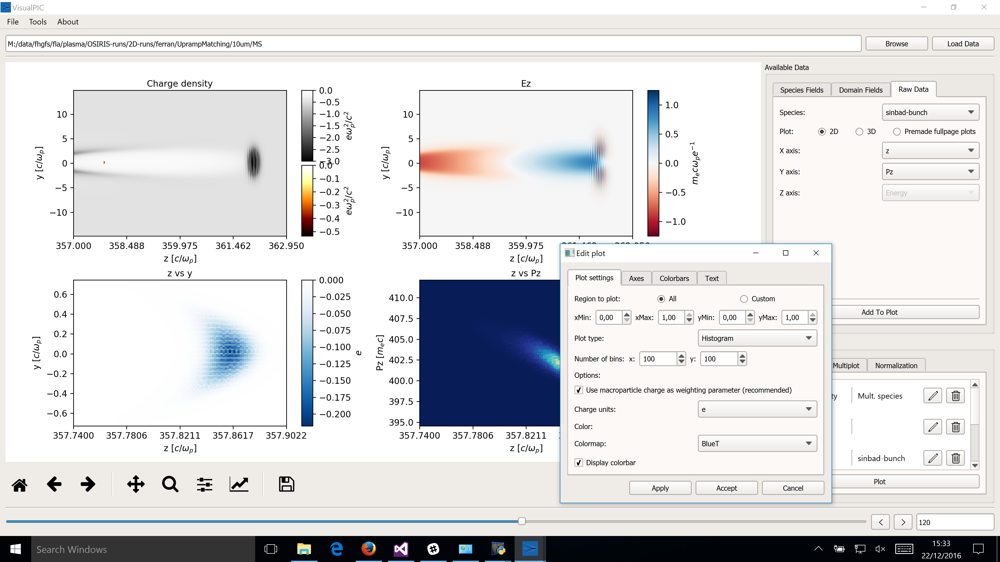

# VisualPIC - A Data Visualizer for PIC Codes

## Introduction

VisualPIC is a new software for data visualization and analysis specifically designed to work with Particle-In-Cell (PIC) simulation codes, mainly for its application in plasma wakefield acceleration.

The original aim of VisualPIC was to provide a flexible and easy-to-use interface for data analysis, allowing the user to visualize the simulation results without having to write any code. This reduces the need of custom made scripts which, even if very efficient for specific cases, can easily tend to become quite cluttered and unpractical when used as the only tool for data visualization.

The main principles under which this application was developed are:

* Easyness of use (must have a graphical user interface).
* Cross-platform.
* Written in Python (and Qt for the interface).
* Open-source.
* Compatibility with multiple PIC codes.
* Open for collaboration.
* Modular design.

The main capabilities of the program include 2D and 3D visualization of fields and particle data, particle tracking through the simulation, the creation of snapshots and animations, as well as a dedicated visualizer for making eye-catching 3D renders of the simulation.

## Installation
At this moment, the current version has only been tested on a Windows machine. Therefore, the installation instructions only apply tho this case, but the list of dependencies is the same for all OSs.

Initially, VisualPIC was developed to work on older Python (< 3.0) and Qt (< 5.0) versions. However, in order to add support for modern High DPI displays it was required to jump to Python 3.5 and Qt 5.7.

### Required software
* Python 3.5.2 (other verions might also work). Choose the 64-bit version, otherwise you will be very limited in memory.
* Qt 5.7 (will be installed with PyQt5).
* FFmpeg.

### Required Python packages
* Numpy.
* SciPy.
* Matplotlib 2 + custom backends (only needed for high DPI displays).
* PyQt5.
* H5Py.
* Pillow.

### Windows Installation
* Install Python 3.5.2. Download [here](https://www.python.org/downloads/release/python-352/).
* Dowload the numpy+MKL wheels from [here](http://www.lfd.uci.edu/~gohlke/pythonlibs/#numpy).
  * Then, on cmd, go to the folder where you downloaded the file and run `pip install numpy-1.12.0+mkl-cp35-cp35m-win_amd64.whl`
* Dowload the SciPy wheels from [here](http://www.lfd.uci.edu/~gohlke/pythonlibs/#scipy).
  * Then, on cmd, go to the folder where you downloaded the file and run `pip install scipy‑0.18.1‑cp35‑cp35m‑win_amd64.whl`
* Install PyQt5: `pip install pyqt5`.
* Install Pillow: `pip install pillow`.
* Dowload the H5Py wheels from [here](http://www.lfd.uci.edu/~gohlke/pythonlibs/#h5py).
  * Then, on cmd, go to the folder where you downloaded the file and run `pip install h5py-2.6.0-cp35-cp35m-win_amd64.whl`
* Install matplotlib: `pip install matplotlib`.
  * After, copy the custom backend found in the folder `VisualPIC/Custom Matplotlib Backends` into `[Your Python Path]\Lib\site-packages\matplotlib\backends`. This will enable high resolution icons.
* Dowload the H5Py wheels from [here](http://www.lfd.uci.edu/~gohlke/pythonlibs/#h5py).
  * Then, on cmd, go to the folder where you downloaded the file and run `pip install h5py-2.6.0-cp35-cp35m-win_amd64.whl`
* Download the VTK wheels for your Python version from [here](http://www.lfd.uci.edu/~gohlke/pythonlibs/#vtk)
  * Then, on cmd, go to the folder where you downloaded the file and run `pip install h5py-2.6.0-cp35-cp35m-win_amd64.whl`
  * Finally, copy the custom file `QVTKRenderWindowInteractor.py` found in the folder `VisualPIC/Custom VTK Files` into `[Your Python Path]\Lib\site-packages\vtk\qt4`.
* Download FFmpeg ([link](https://ffmpeg.zeranoe.com/builds/)) and add it to your system PATH (As explained [here](http://www.wikihow.com/Install-FFmpeg-on-Windows), for example).
* After this, you should be able to run VisualPIC just by running the `__main__.py` file in the VisualPIC folder.

## Collaborating

### Adding support for more PIC codes

One of the main objectives when designing VisualPIC was that it should be able to read data from any code, but without adding more complexity to the main logic.

As a consequence, all the data reading process has been isolated from the rest of the code in well defined clases that read the data and "give it" to the rest of the code in a standarized way, independent from the simulation code that was used to create the data files.

For more details about this and on how to add compatibility for more simulation codes, see the [documentation](/Documentation/AddSupportForAnotherCode.md).

## Citing VisualPIC
If you use VisualPIC to produce plots or figures for any scientific work, please provide a reference to the following publication:

A. Ferran Pousa et al., “VisualPIC: A New Data Visualizer and Post-Processor for Particle-in-Cell Codes”, presented at IPAC’17, Copenhagen, Denmark, May 2017, paper TUPIK007.
