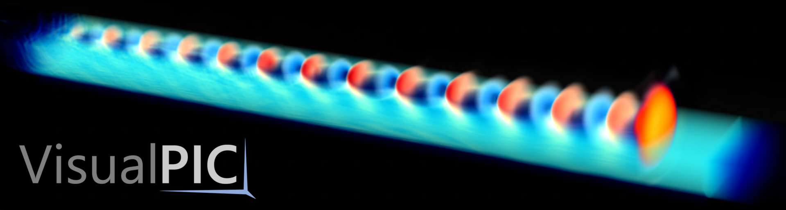
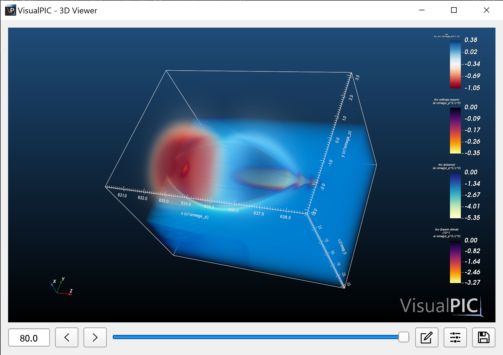
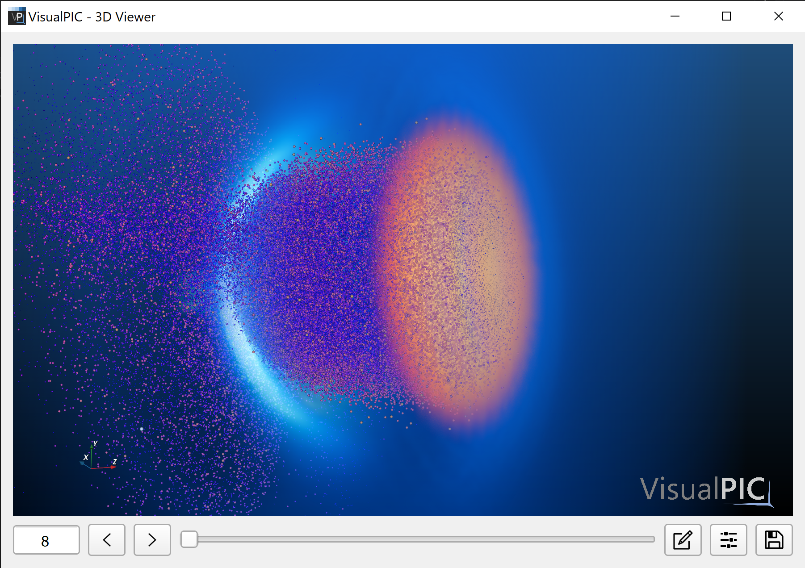

# VisualPIC - Data Visualization for Particle-in-Cell Codes



## v0.5: A redesigned VisualPIC

VisualPIC is currently undergoing a major rewrite of its codebase. Certain limitations in the design of the initial versions led to ever growing issues and unnecessary complexity when expanding its functionality to, for example, handle data with different geometries. To overcome these and other problems, a new completely redesigned version is being developed with a focus on the following key aspects:

* Providing a simple API for data access which is common for all supported simulation codes and data formats and can handle all possible geometries.

* On top of this, develop APIs for 2D and 3D data visualization which are fully decoupled from the GUI and can be easily used for scripting.

* The code should be well documented and (finally) adhere to the PEP-8 style guide.

This branch contains the latest developments in the new redesign and gives you a preview of what is ahead for `VisualPIC 0.5`. At the time of writing, the main features of the APIs for  data reading and 3D visualization have been implemented. The images below (as well the render on top) showcase some of the possibilities offered by this new version.

<p align="center">
  
  
</p>

If you want to test it by yourself, follow the instructions below and check out the provided example [here](https://github.com/AngelFP/VisualPIC/tree/dev/examples/example_1).

## How to install

1) Install the development branch of VisualPIC:
```bash
python -m pip install git+https://github.com/AngelFP/VisualPIC.git@dev
```

2) If you want to use the 3D rendering features and GUI, you will also need to install `VTK`, `pyvista` and `PyQt5`:
```bash
python -m pip install vtk pyvista pyqt5
```


## Citing VisualPIC
If you use VisualPIC to produce plots or figures for any scientific work, please provide a reference to the following publication:

A. Ferran Pousa et al., *VisualPIC: A New Data Visualizer and Post-Processor for Particle-in-Cell Codes*, presented at IPAC’17, Copenhagen, Denmark, May 2017, paper TUPIK007.
