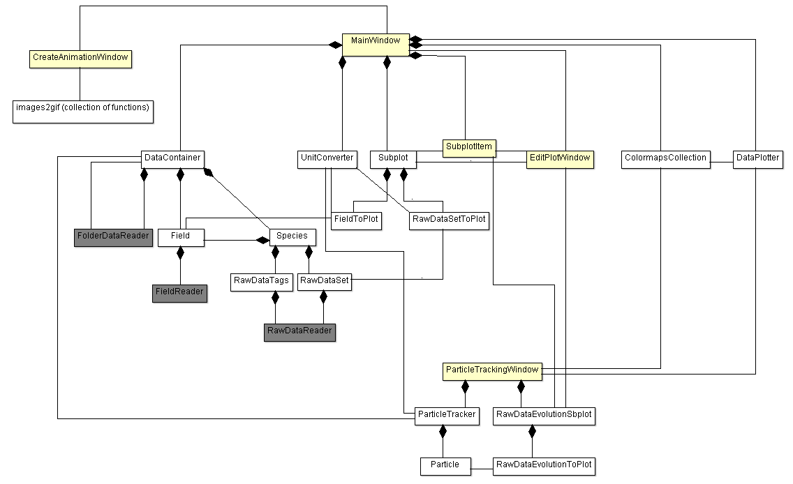

# VisualPIC
Data visualizer for PIC codes.

## Adding compatibility for more PIC codes

VisualPIC is designed in a way that only a number of classes which are in direct contact with the 
data files (mainly the data readers) have to be modified or created in order to add compatibility 
for a new PIC code.

In the following simplified class diagram, this would be the dark gray classes plus the unit converter:

