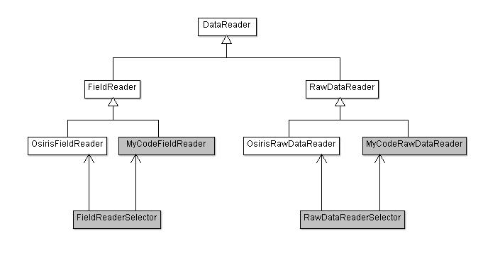

# VisualPIC
Data visualizer for PIC codes.


## Support for multiple PIC codes

VisualPIC is designed in a way that only a number of classes which are in direct contact with the 
data files (mainly the data readers) have to be modified or created in order to add compatibility 
for a new PIC code.

In the following simplified class diagram, these would be the dark gray classes plus the unit converter.
All of these classes read and process the data so that the rest of the VisualPIC code is independent of the
inner format of the data files.


### Structure of the data in VisualPIC

As seen above, there are 4 classes that will have to be modified in order to add support for another PIC code, which are:

- FolderDataReader
- FieldReader
- RawDataReader
- UnitConverter

Before explaining the inner structure of each of these classes, let's explain in general terms how the data reading process works in VisualPIC:

One of the first things that has to be noticed is that there are 3 types of data (Fields, RawDataSets and RawDataTags). Let's explain each of them:

- **Fields**: By definition, a physical quantity that has a value for each point in space and time. This includes the components (x, y or z) of the electric and magnetic fields, the currents and, in some codes like OSIRIS, the charge density of a certain species.
- **RawDataSets**: We call Raw data to the macroparticle data. That is, data sets which contain the information of each macroparticle (position, momentum, charge, energy) so that a scatter or histogram plot can be made. It should be noted that one RawDataSet is created for each macroparticle variable (one for the x coordinate, another for the y coordinate, and so on), so usually we have around 7 or 8 data sets.
- **RawDataTags**: In some simulation codes, in order to allow particle tracking, it is possible to add a tag or label to each macroparticle. Since this information is not a physical quantity or anything that we want to plot, it is stored separately in the RawDataTags class.

From these data sets, the RawDataTags and RawDataSets will always belong to a Species object. The fields can be independent from a species (e.g. electric and magnetic fields) or they can also belong to a particular species (e.g. charge density and current).

All these data objects are stored in the so-called DataContainer, where they are organized in just two lists: a list containing all the Species (which, at the same time, contain all the fields and RawData sets from that species) and another list containing al the Fields that do not belong to a particular species, the so-called "Domain Fields".

In order to create this data structure and read the data files there are three classes:

- **FolderDataReader**: This class is associated with the DataContainer and its main task is to scan the folder where all the data files are located. By doing so, it detects all the fields, raw data and species, and creates and adds all the corresponding objects (Species, Fields, RawDataSets and RawDataTags) to the DataContainer.
- **FieldReader** and **RawDataReader**: Two very similar classes whose function is kind of self-explanatory. Each field will condain a FieldReader, and each RawDataSet and RawDataTags will contain a RawDataReader. These readers know the inner structure of the data file, so that when we ask a Field or RawDataSet to return their data, they will call their inner data reader to perform the task.

### Adding compatibility for another PIC code

Now that we have a general idea of how the data is structured and what each class is doing, we can explain what do we have to modify to add compatibility for another code. Let's go class by class.

#### 1. FolderDataReader

Location: VisualPIC/DataReading/folderDataReader.py

##### 1.1. Detecting the simulation code and calling the right method.

In VisualPIC, the user has to indicate the location of the data folder (e.g. MS folder in the case of OSIRIS). Then, when he clicks on "Load Data", VisualPIC detects which simulation code is the data from and calls the corresponding method to effectively load the data. At the moment, this is done based on the name of the simulation data folder because at least for Osiris and PIConGPU this is always called "MS" or "simOutput" respectively.

This is done in the "CreateCodeDictionaries" method. You have to add an entry to the self._codeName dictionary in the following way: 

```python
self._codeName = {"MS":"Osiris",
                  "simOutput":"PIConGPU",
			      "folderName":"myCodeName"} # <-- Line to add
```

Where "folderName" is the typical name of the simulation data folder created by your code, and "myCodeName" is the name of your simulation code.

Then, since every simulation software stores the data in a different way, a specific method for scanning the folder and loading the data has to be created for each case, and VisualPIC will know which method to call depending on the detected simulation code name. This is also done by using a dictionary:

```python
self._loadDataFrom = {"Osiris": self.LoadOsirisData,
                      "PIConGPU":self.LoadPIConGPUData,
					  "myCodeName": self.LoadMyCodeData} # <-- Line to add (method will be created later)
```

##### 1.2. Methods to create

First of all, I have to say that the way in which data loading is implemented in this class might be a bit ugly, but it's the best I could do in the short time I had until now to develop this tool.

Under the section "Specific data loaders", we will have to create a subsection for the new code in which we wil create 3 methods. As an example, this is what it looks like for Osiris:

```python
"""
Specific data loaders
"""
# OSIRIS
def LoadOsirisData(self): [...]

def GetTimeStepsInOsirisLocation(self, location): [...]

def GiveStandardNameForOsirisQuantity(self, osirisName): [...]

# NameOfYourCode
	# The 3 methods have to be implemented here.
```

Let's see what's the function of each of them (replace "MyCode" with the name of your simulation code), from bottom to top:

1. GiveStandardNameForMyCodeQuantity(self, osirisName).
  * Function: You give as input the name of the quantity (Field or RawData) in your code and get in return its standard VisualPIC name.
  * Detailed explanation: Each code stores the data with different names. For example, in OSIRIS, the components of the electric field are called "e1", "e2" and "e3", the energy is called "ene", and so on. Therefore, in order to make VisualPIC code-independent, common names for each quantity have been defined (e.g. "Ex", "Ey", "Ez" for the electric field components).
  This method was created in order to translate from the code-specific data name into the common names defined in VisualPIC.
  * Example: GiveStandardNameForOsirisQuantity("e1") returns "Ez".

2. GetTimeStepsInMyCodeLocation(self, location): 
  * Function: Returns a 1D numpy array containing all the time steps of a particular Field or RawDataSet stored in the simulation folder.
  * Detailed explanation: Typically, one does not store all the simulation time steps, but only one every "n" steps. 
  Furthermore, it is generally possible to change the frequency with which the time steps are saved for each physical 
  quantity (maybe one wants to save more frequently the charge density than the electric field). Therefore, VisualPIC 
  needs to know which time steps have been saved for each of the stored data sets, so that it knows which data files 
  to read. That is why this method was included.
  * Example: Let's say that after an OSIRIS simulation is finished we have 3 files in the "e1" folder named e1-000000.h5, 
  e1-000050.h5 and e1-000100.h5. This means that only the time steps 0, 50 and 100 have been saved. Therefore, this method should retunr the array [0, 50, 100].

3. LoadMyCodeData(self):
  * Function: Scans the simulation folder and creates all the necessary Species, Fields, RawDataSet and RawDataTags objects.
  * Detailed explanation: This is the real core of the FolderDataReader class. It should scan the whole folder tree in the location of the simulation data, using the already built-in methods
        ```python
  self.AddSpecies(..)
  self.AddFieldToSpecies(..)
  self.AddDomainField(..)
  self.AddRawDataToSpecies(..)
  self.AddRawDataTagsToSpecies(..)
        ```
  in order to add all the data into the DataContainer.

  * Example: The implementation of this method might be very different from code to code, but to get a general idea one can look at how "LoadOsirisData" is implemented in VisualPIC.

#### 2. DataReaders

The FieldReader and RawDataReader classes are very similar, sharing most of their methods. In fact, 
as seen in the picture below, both of them inherit from the more general parent class DataReader.



At the same time, FieldReader and RawDataReader include all the necessary methods required by VisualPIC, 
but not all of them are implemented. Instead, the strategy used here is that, as seen in the picture, 
for each supported simulation code these methods will be implemented in a child class of FieldReader and RawDataReader.

Methods to implement (apart from constructor):

* FieldReader:
  * ReadInternalName(self, file_content)
  * DetermineFieldDimension(self, file_content)
  * OpenFileAndReadData(self)
  * OpenFileAndReadUnits(self)
  * OpenFile(self, timeStep)

* RawDataReader:
  * OpenFileAndReadData(self)
  * OpenFileAndReadUnits(self)
  * OpenFile(self, timeStep)

Let's take a look at how to implement them:

##### 2.1 FieldReader

Location: VisualPIC/DataReading/fieldReaders.py

1. Create a new field reader for your code (in the same fieldReaders.py file), inheriting from FieldReaderBase:
  ```python
  class MyCodeFieldReader(FieldReaderBase):
    def __init__(self, location, speciesName, dataName, firstTimeStep):
	FieldReaderBase.__init__(self, location, speciesName, dataName, firstTimeStep)

    def ReadInternalName(self, file_content):
	raise NotImplementedError

    def DetermineFieldDimension(self, file_content):
	raise NotImplementedError

    def OpenFileAndReadData(self):
	raise NotImplementedError

    def OpenFileAndReadUnits(self):
	raise NotImplementedError

	def OpenFile(self, timeStep):
        raise NotImplementedError
  ```
2. Implement each of the methods. From top to bottom:

  1. OpenFile(self, timeStep).
    * Function: returns a `h5py.File` object corresponding to the time step indicated in `timeStep` (an integer)
    * Detailed explanation: You should create the file path by using the properties `self.location` (simulation folder path), `self.dataName`, `self.speciesName` and `timeStep`. You should assume that the `self.something` properties are already set up.
    * Example: Look at OSIRIS implementation.

  2. OpenFileAndReadUnits(self).
    * Function: Opens the file using the `self.OpenFile(self.firstTimeStep)` method and reads and stores the data units in the `self.dataUnits`, `self.axisUnits` and `self.timeUnits` properties.
    * Detailed explanation: This method is just used to get the units of the field, spatial axes and time. Therefore, it doesn't matter which time step do we open, so the self.firstTimeStep is used.
	  The property `self.dataUnits` should be the field units as a string, and the same goes for `self.timeUnits`. For `self.axisUnits`, this is actually a dictionary containg the units of each axis.
    * Example:
	```python
	def OpenFileAndReadUnits(self):
        file_content = self.OpenFile(self.firstTimeStep)
        self.axisUnits["x"] = yourXAxisUnits
        self.axisUnits["y"] = yourYAxisUnits
        self.dataUnits = yourFieldUnits
        self.timeUnits = yourTimeUnits
	```

  3. OpenFileAndReadData(self).
    * Function: Opens the file using the `self.OpenFile(self.currentTimeStep)` method and reads and stores the data in the `self.data`, `self.axisData` and `self.currentTime` properties.
    * Detailed explanation: You should assume that `self.currentTimeStep` is already set. Then, `self.data` has to be a numpy array containing the field data, `self.currentTime` will be just a number corresponding to the time in current time step and `self.axisData` is again a dictionary containing a numpy array for each axis.
    * Example:
	```python
	def OpenFileAndReadData(self):
        file_content = self.OpenFile(self.currentTimeStep)
        self.data = yourFieldData (nummpy array)
        self.currentTime = currentTime
        self.axisData["x"] = yourXAxisData (nummpy array)
        self.axisData["y"] = yourYAxisData (nummpy array)
        if self.fieldDimension == "3D":
            self.axisData["z"] = yourZAxisData (nummpy array)
        file_content.close()
	```

  4. DetermineFieldDimension(self, file_content).
    * Function: reads and stores in `self.internalName` the name under which the field is saved in the hdf5 file.
    * Detailed explanation: Assume `file_content` to be an `h5py.File` instance. The name of the field will be one of the keys stored in it.
    * Example: for OSIRIS, this is done by detecting whether the entry `'/AXIS/AXIS3'` is present in `file_content`

  5. ReadInternalName(self, file_content).
    * Function: determines and stores in `self.fieldDimension` the dimmension of the field (`"2D"` or `"3D"`).
    * Detailed explanation: Assume `file_content` to be an `h5py.File` instance. Check for something in `file_content` in order to determine de dimmension of the field.
    * Example: for OSIRIS, this method is simply 
    ```python
    def ReadInternalName(self, file_content):
		self.internalName = "/" + list(file_content.keys())[1]
    ```

##### 2.2 RawDataReader

Location: VisualPIC/DataReading/rawDataReaders.py

1. Create a new field reader for your code (in the same fieldReaders.py file), inheriting from FieldReaderBase:
  ```python
  class MyCodeRawDataReader(FieldReaderBase):
    def __init__(self, location, speciesName, dataName, internalName):
        RawDataReaderBase.__init__(self, location, speciesName, dataName, internalName)

    def OpenFileAndReadData(self):
	raise NotImplementedError

    def OpenFileAndReadUnits(self):
	raise NotImplementedError

	def OpenFile(self, timeStep):
        raise NotImplementedError
  ```
2. Implement each of the methods. From top to bottom:

  1. OpenFile(self, timeStep).
    * Function: returns a `h5py.File` object corresponding to the time step indicated in `timeStep` (an integer)
    * Detailed explanation: The same as in the FieldReader. This method is also included here because the naming of the files storing the raw data might be different from the convention used for the fields.
    * Example: Look at OSIRIS implementation.

  2. OpenFileAndReadUnits(self).
    * Function: Opens the file using the `self.OpenFile(self.firstTimeStep)` method and reads and stores the data units in the `self.dataUnits` and `self.timeUnits` properties.
    * Detailed explanation: This method is just used to get the units of the raw data set and time. Therefore, it doesn't matter which time step do we open, so the self.firstTimeStep is used.
	  The property `self.dataUnits` should contain the units of the physical quantity specified in `self.internalName`, and the same goes for `self.timeUnits`.
    * Example:
	```python
	def OpenFileAndReadUnits(self):
        file_content = self.OpenFile(self.firstTimeStep)
        self.dataUnits = yourDataUnits
        self.timeUnits = yourTimeUnits
	```

  3. OpenFileAndReadData(self).
    * Function: Opens the file using the `self.OpenFile(self.currentTimeStep)` method and reads and stores the data in the `self.data` and `self.currentTime` properties.
    * Detailed explanation: You should assume that `self.currentTimeStep` is already set. Then, `self.data` has to be a numpy array containing the data of the specified physical quantity (use `self.internalName`) and `self.currentTime` will be just a number corresponding to the time in current time step.
    * Example:
	```python
	def OpenFileAndReadData(self):
        file_content = self.OpenFile(self.currentTimeStep)
        self.data = yourData (nummpy array)
        self.currentTime = currentTime
        file_content.close()
	```
##### 2.3 Adding the FieldReader and RawDataReader to the data reader selector

As you can see, there will be many different data readers in VisualPIC, so the code has to know which one to use. This is done in the `FieldReaderSelector` and `RawDataReaderSelector` located in VisualPIC/DataReading/dataReaderSelectors.py.

It is very simple to add your readers to the selector. To do so, just add a new entry do the `dataReaders` dictionary in both selectors:

1. For the RawDataReaderSelector:
  ```python
	dataReaders = {"Osiris": OsirisRawDataReader,
                   "HiPACE": HiPACERawDataReader,
                   "PIConGPU": PIConGPURawDataReader,
				   "NameOfMyCode": MyCodeRawDataReader # <-- Line to add
                   }
  ```

2. For the FieldReaderSelector:
  ```python
    dataReaders = {"Osiris": OsirisFieldReader,
                   "HiPACE": HiPACEFieldReader,
                   "PIConGPU": PIConGPUFieldReader
				   "NameOfMyCode": MyCodeFieldReader # <-- Line to add
                   }
  ```

#### 4. UnitConverter
