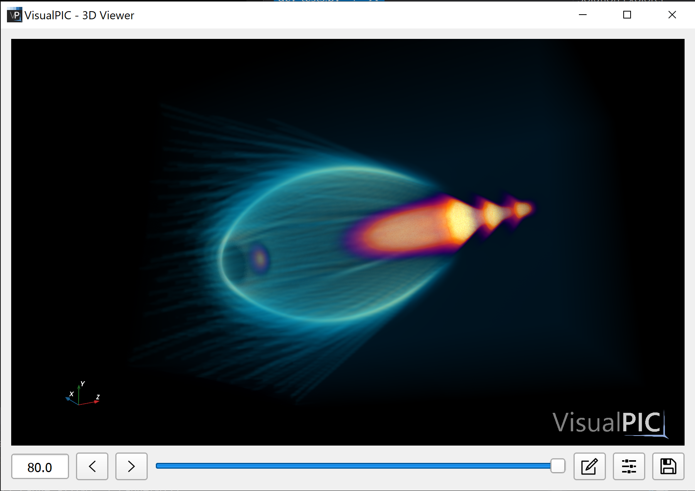

# VisualPIC - Data Visualization for Particle-in-Cell Codes


## Welcome to a redesigned VisualPIC experience

VisualPIC is currently undergoing a major rewrite of its codebase. Certain limitations in the design of the initial versions led to ever growing issues and unnecessary complexity when expanding its functionality to, for example, handle data with different geometries. To overcome these and other problems, a new completely redesigned version is being developed with a focus on the following key aspects:

* Providing a simple API for data access which is common for all supported simulation codes and data formats and can handle all possible geometries.

* On top of this, develop APIs for 2D and 3D data visualization which are fully decoupled from the GUI and can be easily used for scripting.

* The code should be well documented and (finally) adhere to the PEP-8 style guide.

This branch contains the latest developments in the new redesign and gives you a preview of what is ahead for `VisualPIC 0.5`. At the time of writing, the main features of the APIs for  data reading and 3D visualization have been implemented. The images below (as well the render on top) showcase some of the possibilities offered by this new version.

<p align="center">
  
  
</p>

If you want to test it by yourself, follow the instructions below and check out the provided example [here](https://github.com/AngelFP/VisualPIC/tree/general_redesign/examples/example_1).

## How to install this new version

1) If you don't have Python (version 3.5 or higher) already installed, download the latest version, for example, from [here](https://www.python.org/downloads/release/python-352/). Choose the 64-bit version if possible to avoid memory limitations. It is recommended to create a virtual environment for `VisualPIC` (you can see how [here](https://docs.python.org/3/library/venv.html), for example). Remember to activate the new environment before proceeding with the installation.

2) Clone this repository to a directory in your computer using `git`
```bash
git clone https://github.com/AngelFP/VisualPIC.git
```
or simply download the code from [here](https://github.com/AngelFP/VisualPIC/archive/general_redesign.zip) and unzip it.

3) If you haven't already, open a terminal in the newly created folder. If you used git to clone the repository, switch to this branch by typing
```bash
git checkout general_redesign
```

4) In principle, `VisualPIC` should be automatically installed by executing the `setup.py` file. However, this might currently fail in some platforms due to a bug in the current version of `PyQt5` (5.14.1) in the PyPI repository. To avoid this, simply begin by installing the previous version with
```bash
pip install pyqt5==5.14
```

5) After this, perform the installation with
```bash
python setup.py install
```

6) To get access to some of the 3D visualization features, `vtk 8.2` or higher is required. However, the latest version available on `PyPI` is `8.1.2`. To fix this, you can install version `8.2` from the `conda-forge` repository with
```bash
conda install -c conda-forge vtk
```

## Collaborating

This branch is in active development and contributions are more than welcome, particularly for implementing support for new codes and geometries in the data readers. If you are interested in adding any functionality, start by forking this branch and make a PR once your changes are ready to be merged.


## Citing VisualPIC
If you use VisualPIC to produce plots or figures for any scientific work, please provide a reference to the following publication:

A. Ferran Pousa et al., *VisualPIC: A New Data Visualizer and Post-Processor for Particle-in-Cell Codes*, presented at IPAC’17, Copenhagen, Denmark, May 2017, paper TUPIK007.
