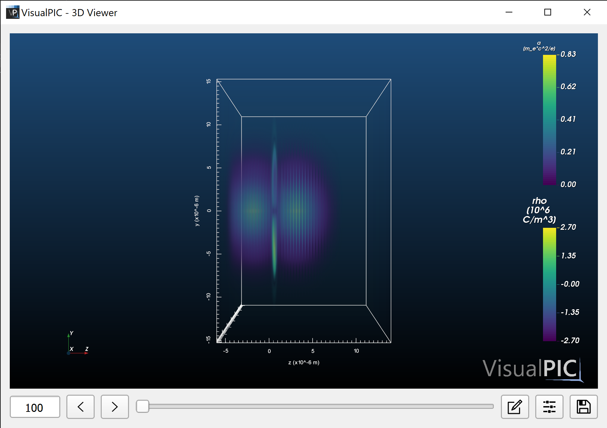
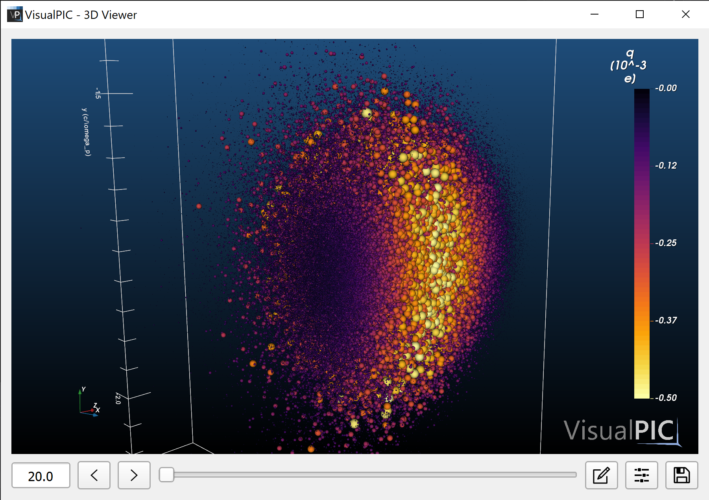

# VisualPIC examples
This folder contains examples covering the basic use of the code:

* [Example 1](example_1): simple example showing how to visualize the 3D fields in a simulation.

  

* [Example 2](example_2): simple example showing the basics of 3D rendering a particle species.

  

