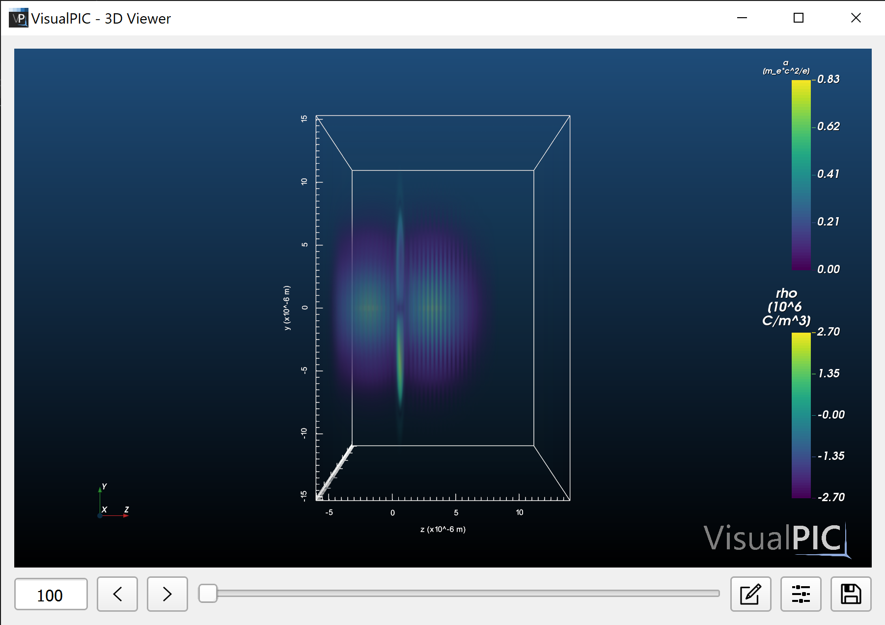

# Example 1 - Basic 3D render

This first example showcases the basic procedure to visualize the 3D fields in a simulation using VisualPIC. To do this, the sample datasets from the `openPMD` repository will be used (download here https://github.com/openPMD/openPMD-example-datasets), but any data in either `openPMD` or `OSIRIS` format can in principle be used as long at it is in 3D cartesian geometry or in cylindrical geometry with azimuthal mode decomposition (so-called `thetaMode` geometry), such as in `FBPIC`. For your convenience, all the code shown in this example is included as a Python script in [basic_3d_rendering.py](basic_3d_rendering.py).

To start, simply import VisualPIC:

```python
import visualpic as vp
```

The next step is to load the simulation data in a so-called `DataContainer` object. This requires indicating the location of the data as well as the data format (`'openPMD'` in this case).
```python
sim_folder_path = '/your/path/to/example-thetaMode/hdf5/'
sim_code = 'openPMD'
dc = vp.DataContainer(sim_code, sim_folder_path)
```

Once the data container has been created, the data is loaded into it by calling:
```python
dc.load_data()
```

Before actually visualizing any of the fields, it might be useful to check which fields are available for this simulation. This can be done by doing:
```python
print(dc.get_list_of_fields())
```
which, for this particular dataset, prints
```python
['Br', 'Bz', 'Bx', 'By', 'Bt', 'Er', 'Ez', 'Ex', 'Ey', 'Et', 'Jr', 'Jz', 'Jx', 'Jy', 'Jt', 'rho', 'I', 'a']
```
This is a list with the names of all available fields in the naming convention used in VisualPIC (that is, no matter what the source of the data is, they will always be called like this). Here `B` and `E` are the magnetic and electric fields, `J` is the current and `rho` is the plasma density. The components of these fields are indicated by the subindex `r` (radial), `z` (longitudinal), `x` (horizontal) and `y` (vertical). In addition to these fields, also the field intensity `I` and normalized vector potential `a` are available, even though they do not exist by themselves in the data files. This is because VisualPIC can automatically generate fields which are derived from those in the actual data files.

Now that we know which fields are available, we can get those which we are interested in visualizing. In this case, these are the plasma density and the normalized vector potential:
```python
rho = dc.get_field('rho')
a = dc.get_field('a')
```

In order to visualize them, we create a `VTKVisualizer` object and add both fields to it:
```python
vis = vp.VTKVisualizer()
vis.add_field(rho)
vis.add_field(a)
```

Once this is done, the visualization is started simply by calling `show()`, as one would do in `matplotlib`:
```python
vis.show()
```
This should open the following window:

<p align="center">
  
</p>

This view allows the user to interact with the 3D data (move, zoom, rotate, etc.), edit the visual properties of the render and navigate through the different time steps of the simulation.

The textbox on the bottom left shows the current time step on display. This can be changed using the left and right arrows or by manipulating the slider. The first button on the right of the slider opens a new window in which the visual properties of each field can be changed, such as the color and the opacity levels. The next button opens a dialog with general settings for the visualizer, such as changing the background, showing/hiding axes, colorbars, etc. Finally, the save button allows you to save the current view to a PNG image.

In this example, since no additional arguments have been given to any of the called functions, the initial appearance of the visualizer and the fields corresponds to the default values. All the visual properties which can be edited in the graphical interface (and even more) can also be set directly in the code. To get a better idea of all the possibilities offered by the 3D viewer, you can check the documentation of the `VTKVisualizer` class [here](../../visualpic/visualization/vtk_visualizer.py).