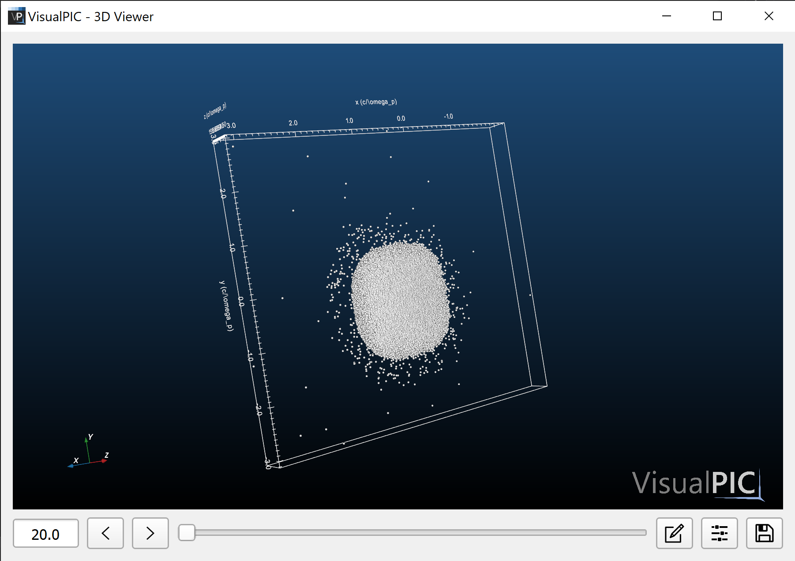
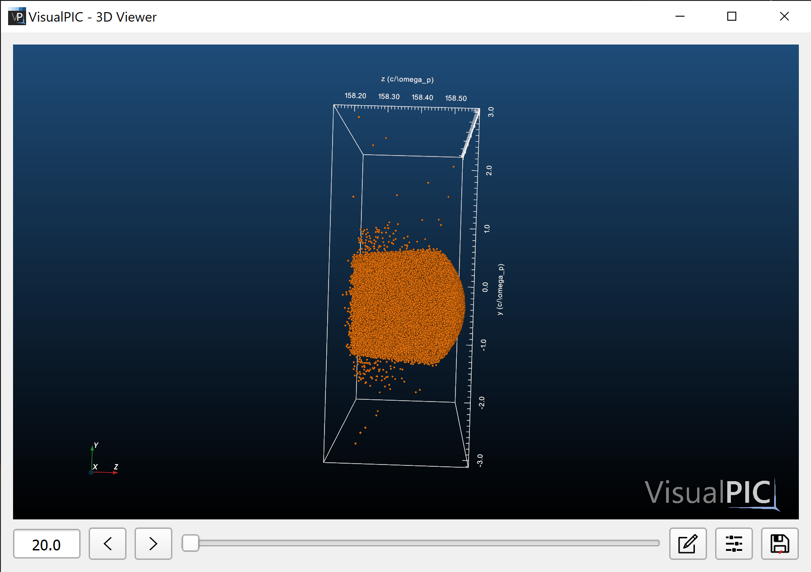
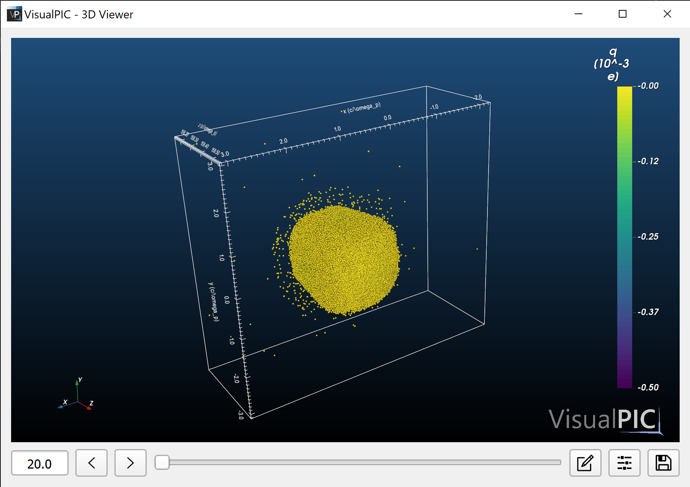
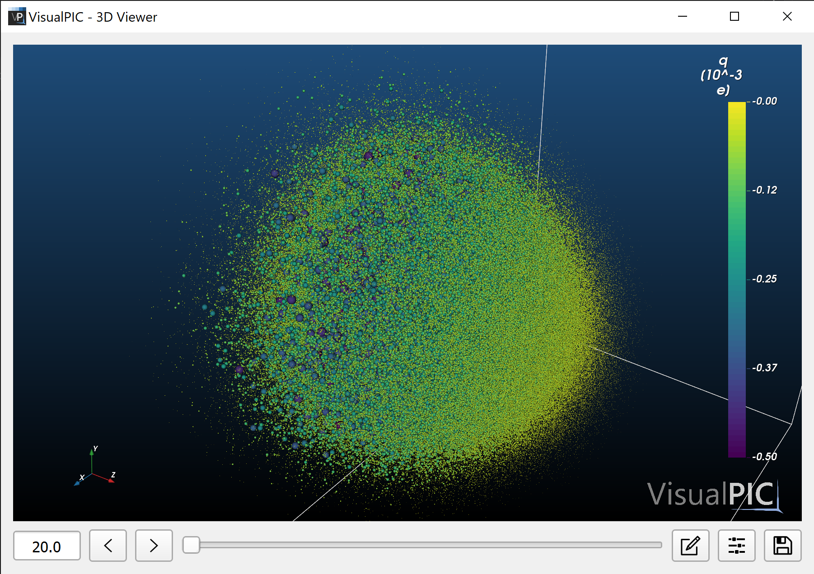
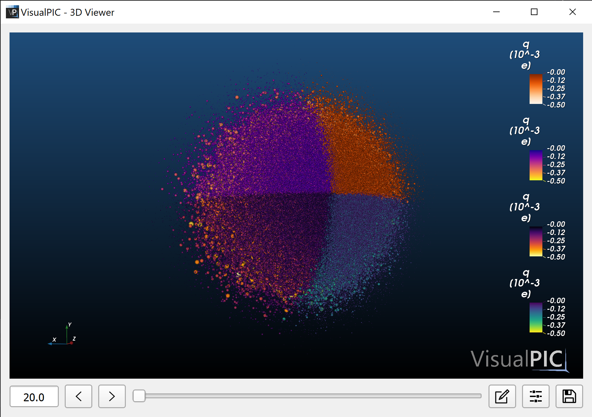

# Example 2 - Basics of rendering particle species

This example illustrates the basics of rendering a particle species in 3D. Each (macro)particle is rendered as a sphere, whose size and color can be adjusted as a function of its charge and other parameters. The visualization of the particle cloud is implemented with the efficient `vtkOpenGLSphereMapper`, which allows displaying millions of particles with good framerate in a typical PC. For your convenience, all the code shown in this example is included as a `Python` script in [species_3d_rendering.py](species_3d_rendering.py).

The data used for this case comes from an `OSIRIS` simulation and can be downloaded from [here](https://desycloud.desy.de/index.php/s/2BzxAr55ycP8eez) (only a single timestep is included). 

To start, simply import VisualPIC and load the simulation data into a `DataContainer`:

```python
import visualpic as vp


sim_folder_path = '/your/path/to/osiris_sample_data/MS/'
sim_code = 'Osiris'
dc = vp.DataContainer(sim_code, sim_folder_path, plasma_density=1e23)
dc.load_data()
```
Notice that in this case we have specified the `plasma_density` parameter. This is in principle not required, but it allows `VisualPIC` to perform unit conversion (if needed), since the `OSIRIS` data is in normalized units.

Before actually visualizing any of the species, it might be useful to check which ones are available for this simulation. This can be done by calling:
```python
print(dc.get_list_of_species())
```
which, for this particular dataset, shows only
```python
['witness-beam']
```
In order to render this species, simply get it from the data container and add it to a `VTKVisualizer` as follows:
```python
witness_beam = dc.get_species('witness-beam')

vis = vp.VTKVisualizer()
vis.add_species(witness_beam)
```

Once this is done, the visualization is started simply by calling `show()`, as one would do in `matplotlib`:
```python
vis.show()
```
By slightly rotating the view in the newly open window, this is what you should be seeing:

<p align="center">
  
</p>

This is the default appearance of a particle species: all particles are white and of equal size. There are however several ways of optimizing its looks. Most of them can be accessed interactively in the open window by clicking on the "edit" button (first one to the right of the slider) and selecting the desired species. In the following, we will review some of the most important attributes which can be changed by looking directly at the code.

The first thing that can be modified, since the beam appears to be rather short compared to its transverse size, is to scale up the longitudinal dimension of the visualizer. This is done simply by specifying the `scale_z` parameter (there are also a `scale_x` and `scale_y` parameter). In this case, the z direction will be scaled by a factor 5:

```python
vis = vp.VTKVisualizer(scale_z=5)
vis.add_species(witness_beam, color='tab:orange')
vis.show()
```
where we have also changed the color of the species. Any `matplotlib` color is accepted. This results in:
<p align="center">
  
</p>
which gives us a better look at the longitudinal distribution of the beam. However, this can be further improved.

In PIC codes in general, it is typical that each macroparticle can have a different charge. This is also the case in this simulation. To visualize this, the color of each particle can be adjusted to its charge by setting `color_according_to='q'` when adding the particle species:

```python
vis.add_species(witness_beam, color_according_to='q')
```
When doing so, a colormap will instead be used to color the species (according to the charge in this case, but any other parameter such as `'x'`, `'pz'`, etc. can also be used), as seen below:
<p align="center">
  
</p>

There is still a problem here, however: all particles seem to look yellow. This is because the beam is surrounded by macroparticles of low charge, which do not allow to see the high-charge particles inside. To fix this, the size of the particles can be scales according to their charge by setting `scale_with_charge=True` when adding the species:

```python
vis.add_species(witness_beam, color_according_to='q', scale_with_charge=True)
```
which allows us to have a much clearer view of the beam:
<p align="center">
  
</p>


In addition, in order to have a look at the inside of the beam, one could remove half of it along `x` by specifying the trimming parameter `xtrim=[-1, 0]`. Here the part between `-1` and `0`  is removed, where `-1` is the leftmost edge of the simulation box and `0` is on-axis. If the size of the simulation box cannot somehow be determined from the simulation metadata, then the extremes `-1` and `1` are determined from the maximum extension of the species. Trimming can also be performed in the `y` and `z` planes through `ytrim` and `ztrim`. In this case, the following code:

```pythyon
vis.add_species(witness_beam, xtrim=[-1, 0], color_according_to='q',
                cmap='inferno_r', scale_with_charge=True)
```
where we have also changed the colormap (any `matplotlib` colormap can be used) results in:
<p align="center">
  
</p>
where it can be clearly seen that the inner part of the beam is made up of particles with the highest amount of charge.

To finalize, just to showcase what is possible, one could play a bit with the trimming parameters to generate a multi-color beam. For example, the species can be added 4 times, each time with trimming a different quadrant and with a different colormap to generate the following beam:

```python
vis = vp.VTKVisualizer(scale_z=5, show_cube_axes=False,
                       show_bounding_box=False)
vis.add_species(witness_beam, xtrim=[-1, 0], ytrim=[-1, 0],
                color_according_to='q', scale_with_charge=True,
                cmap='viridis_r')
vis.add_species(witness_beam, xtrim=[0, 1], ytrim=[-1, 0],
                color_according_to='q', scale_with_charge=True,
                cmap='inferno_r')
vis.add_species(witness_beam, xtrim=[0, 1], ytrim=[0, 1],
                color_according_to='q', scale_with_charge=True,
                cmap='plasma_r')
vis.add_species(witness_beam, xtrim=[-1, 0], ytrim=[0, 1],
                color_according_to='q', scale_with_charge=True,
                cmap='Oranges')
vis.show()
```

<p align="center">
  
</p>

To get a full picture of all possibilities for rendering particle species, you can also have a direct look at the `VTKVisualizer` class [here](../../visualpic/visualization/vtk_visualizer.py).